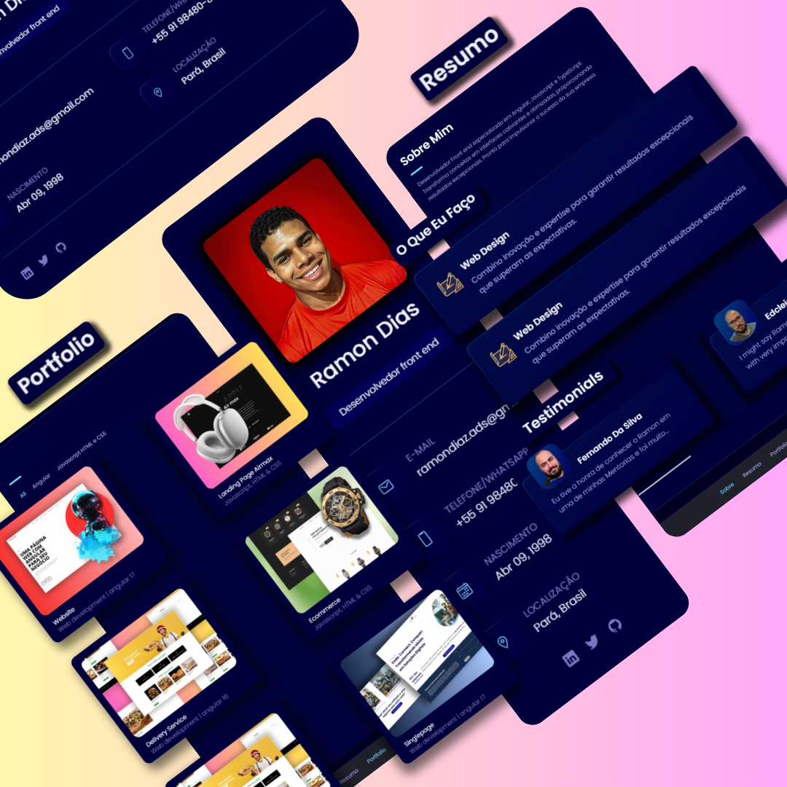
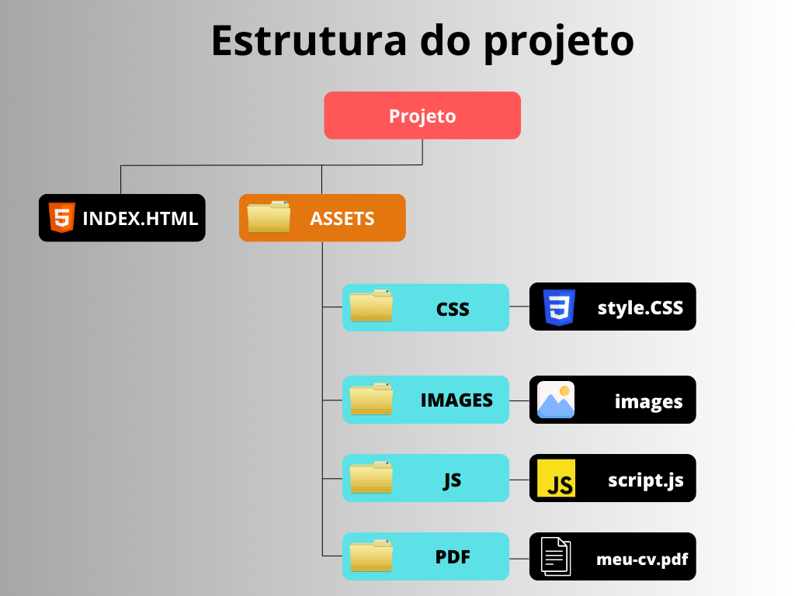

# Portfólio de Ramon Dias

Este repositório contém o código-fonte do portfólio pessoal de Ramon Dias, um desenvolvedor front-end especializado em Angular, JavaScript e TypeScript. Este README.md fornece uma visão geral completa do projeto, incluindo informações sobre sua finalidade, estrutura do projeto, tecnologias utilizadas, instruções de instalação, uso, contribuição e muito mais.

## Sumário

- [1. Visão Geral](#1-visão-geral)
- [2. Tecnologias Utilizadas](#2-tecnologias-utilizadas)
- [3. Estrutura do Projeto](#3-estrutura-do-projeto)
- [4. Instalação](#4-instalação)
- [5. Uso](#5-uso)
- [6. Contribuição](#6-contribuição)
- [7. Licença](#7-licença)

# Visão Geral

O portfólio de Ramon Dias é um projeto web estático desenvolvido para apresentar as habilidades, experiência, projetos e informações de contato de Ramon Dias, um desenvolvedor front-end experiente. Este portfólio foi projetado com o objetivo de demonstrar suas competências técnicas, criatividade e profissionalismo, servindo como um ponto de referência para clientes em potencial, recrutadores e colegas de trabalho.

## Objetivos Principais

- **Demonstrar Habilidades Técnicas:** O portfólio visa destacar as habilidades técnicas em desenvolvimento web front-end, incluindo HTML, CSS e JavaScript, bem como seu conhecimento em bibliotecas e frameworks populares, como Angular e TypeScript.

- **Apresentar Projetos Relevantes:** Uma seção dedicada é reservada para exibir os projetos mais recentes e relevantes desenvolvidos por Ramon Dias. Cada projeto é acompanhado por uma breve descrição, capturas de tela e links para visualização ou repositório no GitHub.

- **Facilitar o Contato:** O portfólio inclui informações de contato de Ramon Dias, como endereço de e-mail e perfis em redes sociais e plataformas profissionais, para facilitar o contato de potenciais clientes, recrutadores ou colaboradores.

## Tecnologias Utilizadas

O portfólio de Ramon Dias utiliza uma combinação de tecnologias front-end e ferramentas de desenvolvimento, incluindo:

- **HTML5 (HyperText Markup Language):** Utilizado para criar a estrutura e o conteúdo semântico do site.
  
- **CSS3 (Cascading Style Sheets):** Responsável pela estilização e aparência visual do portfólio, garantindo uma experiência de usuário atraente e responsiva em diferentes dispositivos e navegadores.
  
- **JavaScript (ECMAScript 6+):** Adiciona interatividade e funcionalidades dinâmicas ao site, como animações, validação de formulários e manipulação do DOM (Document Object Model).
  
- **Ionicons:** Conjunto de ícones vetoriais utilizados para elementos visuais, como botões, links e seções de navegação.

  
## 3. Estrutura do Projeto

O projeto está estruturado da seguinte forma:

## 4. Instalação

Para utilizar o portfólio de Ramon Dias, siga estas instruções:

1. Clone este repositório: git clone https://github.com/seu-usuario/portfolio-ramon-dias.git

2. Navegue até o diretório do projeto: cd nomme do projeto

3. Abra o arquivo `index.html` em seu navegador da web para visualizar o portfólio.

## 5. Uso

Explore as diferentes seções do portfólio, incluindo "Sobre Mim", "Resumo", "Portfólio" e "Contato". Clique nos links e botões interativos para navegar entre as páginas e seções.

## 6. Contribuição

Se você deseja contribuir com este projeto, siga estas etapas:

1. Faça um fork deste repositório.
2. Crie uma branch para sua contribuição: `git checkout -b feature/sua-contribuicao`
3. Faça suas alterações e commit: `git commit -am 'Adicione sua contribuição'`
4. Faça push para a branch: `git push origin feature/sua-contribuicao`
5. Abra um pull request.

## 7. Licença

Este projeto está licenciado sob a [Licença MIT](LICENSE), o que significa que você pode usá-lo livremente, modificar e distribuir, incluindo em projetos comerciais. Consulte o arquivo LICENSE para obter mais informações.
 

